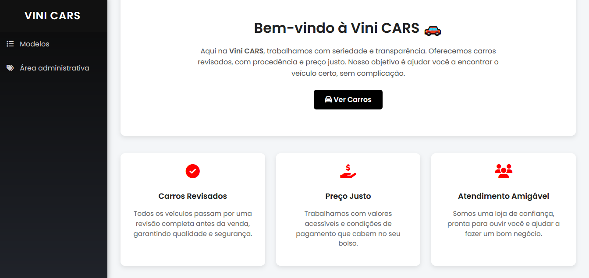
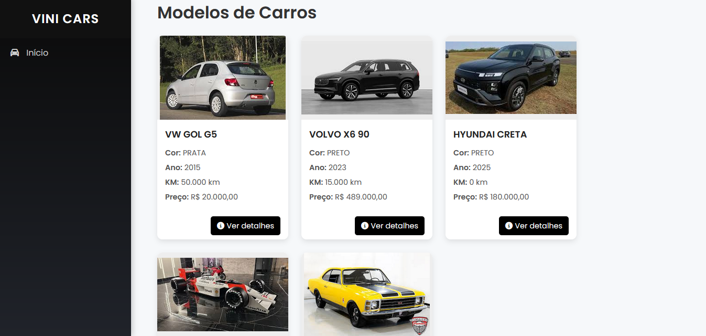
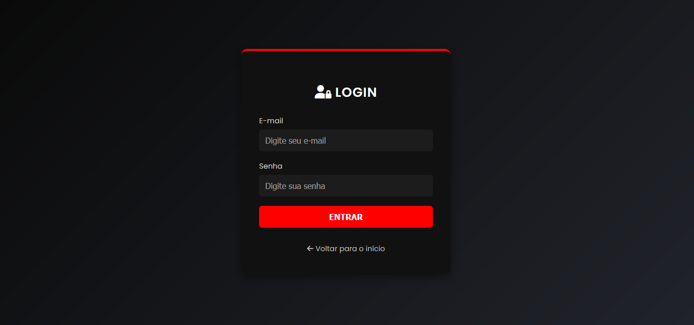
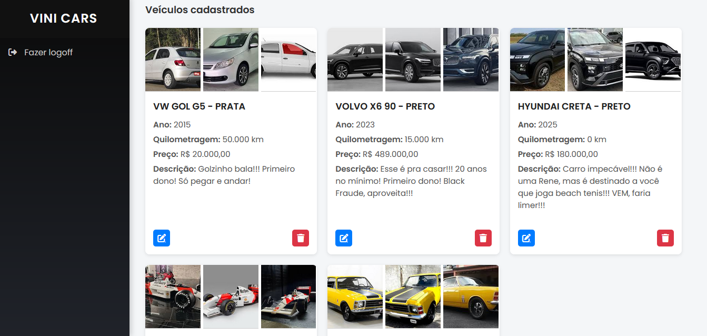
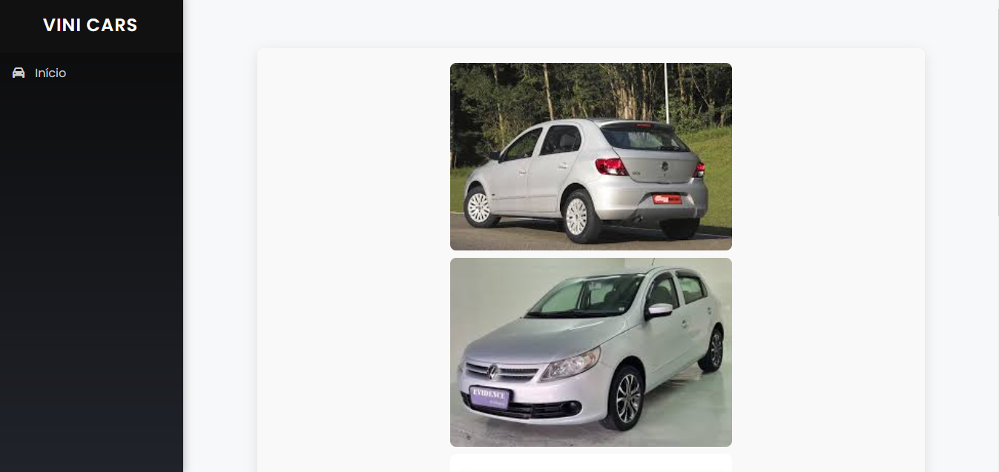
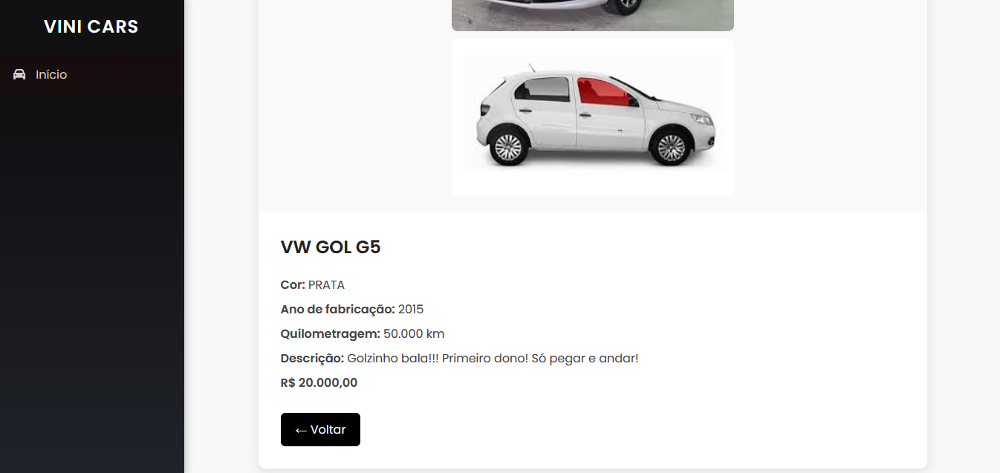
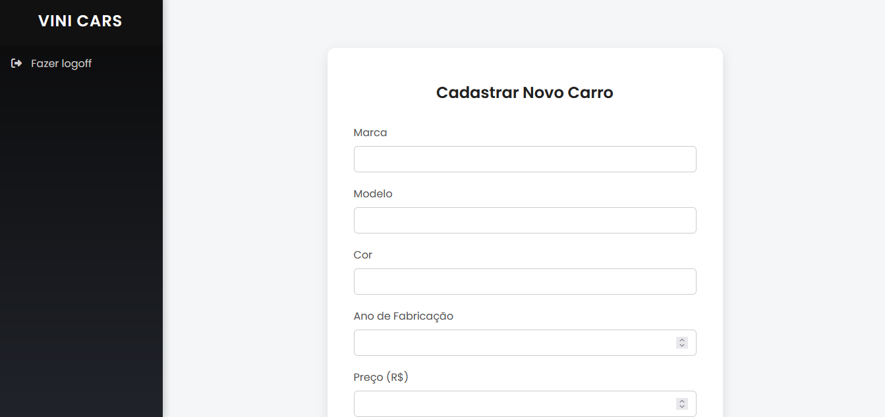
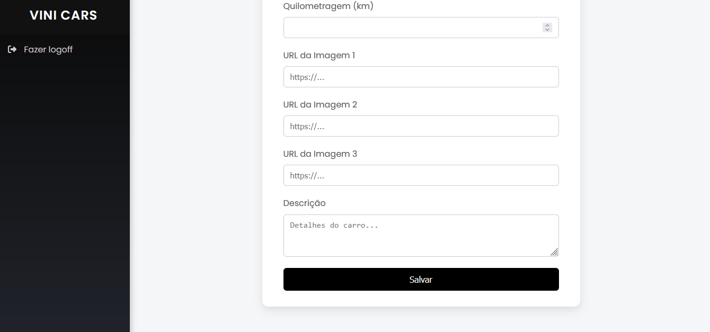
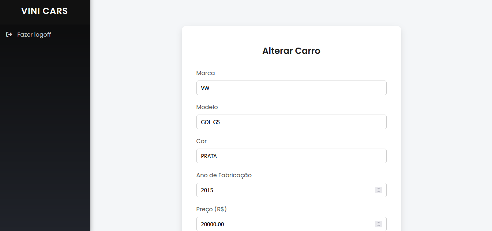
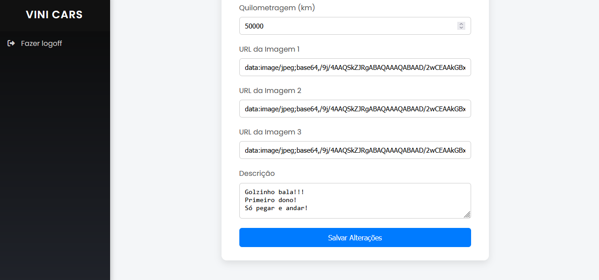

# Como Rodar o Projeto Localmente

## Pré-requisitos

Antes de rodar o projeto, certifique-se de que os seguintes programas estão instalados na máquina:

- PHP 8.0 ou superior
- Composer (gerenciador de dependências do PHP)
- MySQL ou MariaDB


1. Clone o repositório:
```bash
git clone https://github.com/0x56M/loja_carro.git
```

2. Digite no cmd/terminal:
```
cd loja_carro
```

3. Configure o banco de dados:
```
DB_CONNECTION=mysql
DB_HOST=127.0.0.1
DB_PORT=3306
DB_DATABASE=nome_do_banco
DB_USERNAME=root
DB_PASSWORD=
```

4. Instale o composer:
```
composer install
```

5. Crie o arquivo .env:
```
cp .env.example .env
```

6. Gere a chave da aplicação Laravel:
```
php artisan key:generate
```

7. Execute as migrations:
```
php artisan migrate
```

8. Rode o comando para iniciar o servidor local:
```
php artisan serve
```

# Credenciais do Administrador

- **Usuário**: vini@vini.com
- **Senha**: 12345678

# Telas do site

Aqui estão as imagens do site para o projeto:

1. **Tela Principal**  
   

2. **Tela de visualização dos modelos**  
   

3. **Tela de login**
   

4. **Tela do dashboard ADMIN**
   

5. **Tela de detalhes**
   
   

6. **Tela de cadastro**
   
   

7. **Tela de alteração**
   
   
